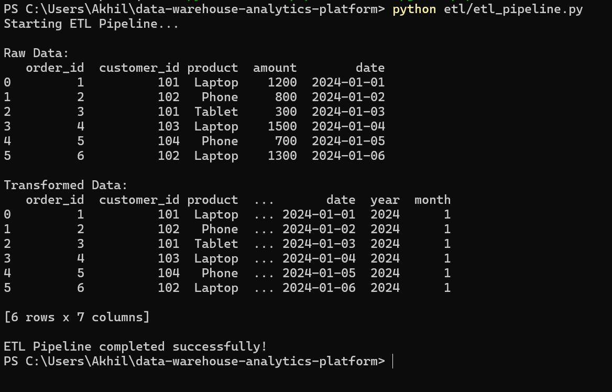

# End-to-End Data Warehouse & Analytics Platform

## Quick Start

Run the ETL pipeline locally:

```bash
pip install -r requirements.txt
python etl/etl_pipeline.py
```

## Overview

I built this project to understand how data is handled in a typical batch processing system, where data is collected, transformed, and made ready for analysis. While a lot of focus today is on real-time systems, batch pipelines still play a major role in reporting, analytics, and business decision-making.

Instead of writing a single script, I approached this as a small data platform — with clear layers for raw data, transformation, and analytics — to reflect how things are structured in real-world environments.

## Purpose of the Project

The main goal of this project was to:

* Understand how raw data is transformed into meaningful insights
* Learn how to structure data pipelines in a clean and scalable way
* Practice working with ETL workflows and SQL-based analytics
* Think beyond code and focus on how data flows across different stages

This project helped me bridge the gap between writing scripts and designing a complete data workflow.

## How this can be used in real life

In real-world scenarios, systems like this are used across industries:

* **E-commerce**: Tracking sales, customer behavior, and revenue trends
* **Finance**: Generating reports and identifying spending patterns
* **Product analytics**: Understanding user activity over time
* **Business intelligence**: Supporting dashboards and decision-making

Even though the dataset here is simple, the structure reflects how production pipelines handle much larger and more complex data.

## What this project does

* Reads raw sales data from a source layer
* Cleans and transforms the data using Python
* Stores processed data separately for analysis
* Provides SQL queries to generate business insights
* Demonstrates a structured end-to-end data pipeline

## How the pipeline is structured

The pipeline follows a simple and practical flow:

**Raw Data → ETL (Transformation) → Processed Data → Analytics**

* Raw data is stored as-is
* ETL layer handles cleaning and enrichment
* Processed data is stored for querying
* SQL layer is used for extracting insights

This layered approach is commonly used in real-world data systems.

## Key Insights (Example)

Using the transformed dataset, the following types of insights can be generated:

* Total revenue generated across all transactions
* Revenue contribution by each product category
* Identification of top customers based on total spend
* Monthly trends in sales performance

These are typical business questions that data teams solve using warehouse-based pipelines.

## Running the project

Install dependencies:

```bash
pip install -r requirements.txt
```

Run the ETL pipeline:

```bash
python etl/etl_pipeline.py
```

The script reads raw data, transforms it, and saves the cleaned dataset to the processed layer.

## Sample Output

The pipeline prints both raw and transformed data during execution and stores the cleaned dataset for further analysis.



## Tech Stack

* Python (Pandas)
* SQL
* Data modeling concepts
* Cloud-aligned design (AWS S3, Glue, Athena – conceptual mapping)

## Project Structure

```
data-warehouse-analytics-platform/
│
├── data/
│   ├── raw/               # Source data
│   └── processed/         # Cleaned data
│
├── etl/
│   └── etl_pipeline.py    # Transformation logic
│
├── sql/
│   └── analysis_queries.sql  # Analytical queries
│
├── dashboards/
│   └── etl_output.png     # Output proof
│
├── requirements.txt
└── README.md
```

## What I focused on

While building this, I focused more on **how the system is structured** rather than just the code.

* Keeping the pipeline modular and easy to understand
* Separating raw and processed data clearly
* Writing transformations that can scale
* Thinking about how this would work in a cloud environment

## How this maps to a cloud setup

Although this project runs locally, it is designed to scale:

* Data storage → Amazon S3
* ETL processing → AWS Glue or Spark
* Query layer → Amazon Athena
* Visualization → QuickSight or BI tools

The idea was to build a strong local foundation that can be extended to cloud systems.

## Final Thoughts

This project gave me a better understanding of how batch data pipelines are designed and how data moves across different stages before it becomes useful for analysis.

It complements real-time systems by focusing on the batch side of data engineering, which is still essential for reporting, analytics, and long-term data processing.
